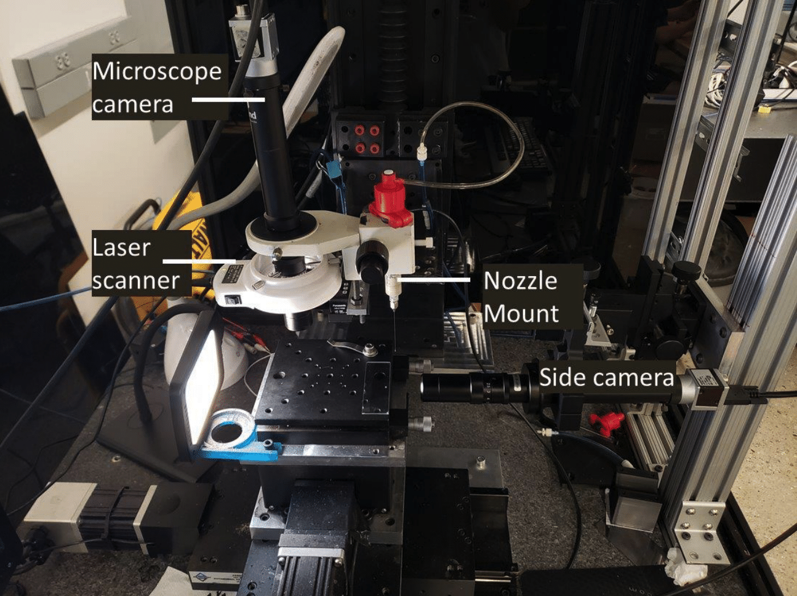

<!-- PROJECT SHIELDS -->
<!--
*** I'm using markdown "reference style" links for readability.
*** Reference links are enclosed in brackets [ ] instead of parentheses ( ).
*** See the bottom of this document for the declaration of the reference variables
*** for contributors-url, forks-url, etc. This is an optional, concise syntax you may use.
*** https://www.markdownguide.org/basic-syntax/#reference-style-links
-->
[![Contributors][contributors-shield]][contributors-url]
[![Forks][forks-shield]][forks-url]
[![Stargazers][stars-shield]][stars-url]
[![Issues][issues-shield]][issues-url]
[![MIT License][license-shield]][license-url]
[![LinkedIn][linkedin-shield]][linkedin-url]

<!-- PROJECT LOGO -->
 

  

  <h3 align="center">Closing the Loop in 3D Printing</h3>

  

     
    <a href="https://github.com/trushant05/cl3dp"><strong>Explore the docs »</strong></a>
     
     
    <a href="https://github.com/trushant05/cl3dp">View Demo</a>
    ·
    <a href="https://github.com/trushant05/cl3dp/issues">Report Bug</a>
    ·
    <a href="https://github.com/trushant05/cl3dp/issues">Request Feature</a>
  

<!-- TABLE OF CONTENTS -->

  
Table of Contents

  <ol>
    <li>
      <a href="#about-the-project">About The Project</a>
      <ul>
        <li><a href="#built-with">Built With</a></li>
      </ul>
    </li>
    <li>
      <a href="#getting-started">Getting Started</a>
    </li>
    <li><a href="#usage">Usage</a></li>
    <li><a href="#roadmap">Roadmap</a></li>
    <li><a href="#license">License</a></li>
    <li><a href="#contact">Contact</a></li>
    <li><a href="#acknowledgments">Acknowledgments</a></li>
  </ol>

<!-- ABOUT THE PROJECT -->
## About The Project

This project presents a Python-based framework designed to integrate vision-based feedback into the additive manufacturing process, enabling precise closed-loop control. By extruding conductive ink under pressure, we achieve printing resolutions down to the micrometer scale. The framework employs a proportional (P-type) controller with a linear filter to ensure high-quality prints and accuracy.

(<a href="#readme-top">back to top</a>)

### Built With

This section should list any major frameworks/libraries used to bootstrap your project. Leave any add-ons/plugins for the acknowledgements section. Here are a few examples.

* [![Python][Python-badge]][Python-url]
* [![MATLAB][Matlab-badge]][Matlab-url]
* [![OpenCV][Opencv-badge]][Opencv-url]
* [![Scikit_learn][Scikitlearn-badge]][Scikitlearn-url]

(<a href="#readme-top">back to top</a>)

<!-- GETTING STARTED -->
## Getting Started

Clone this GitHub repo and follow this installation guide for details.

_For more details, please refer to the [Documentation](https://example.com)_

(<a href="#readme-top">back to top</a>)

<!-- USAGE EXAMPLES -->
## Usage

The software allows testing stages, controller, printer and vision system independently.

_For more details, please refer to the [Documentation](https://example.com)_

(<a href="#readme-top">back to top</a>)

<!-- ROADMAP -->
## Roadmap

- [x] Add stage controller module
- [x] Add pressure module
- [x] Add P-Type controller module with linear filter
- [x] Add camera module
- [x] Add printer module (combines stages, controller and vision sub-system)
- [x] Add test cases for each sub-system
- [x] Add configuration scripts (YAML) for each sub-system
- [x] Add test cases for each sub-system
- [x] Add printing scripts

See the [open issues](https://github.com/trushant05/cl3dp/issues) for a full list of proposed features (and known issues).

(<a href="#readme-top">back to top</a>)

<!-- LICENSE -->
## License

Distributed under the MIT License. See `LICENSE.txt` for more information.

(<a href="#readme-top">back to top</a>)

<!-- CONTACT -->
## Contact

Trushant Adeshara - trushant@umich.edu

Project Link: [https://github.com/your_username/repo_name](https://github.com/your_username/repo_name)

(<a href="#readme-top">back to top</a>)

<!-- ACKNOWLEDGMENTS -->
## Acknowledgments

Use this space to list resources you find helpful and would like to give credit to. I've included a few of my favorites to kick things off!

* [Choose an Open Source License](https://choosealicense.com)
* [GitHub Emoji Cheat Sheet](https://www.webpagefx.com/tools/emoji-cheat-sheet)
* [Malven's Flexbox Cheatsheet](https://flexbox.malven.co/)
* [Malven's Grid Cheatsheet](https://grid.malven.co/)
* [Img Shields](https://shields.io)
* [GitHub Pages](https://pages.github.com)
* [Font Awesome](https://fontawesome.com)
* [React Icons](https://react-icons.github.io/react-icons/search)

(<a href="#readme-top">back to top</a>)

<!-- MARKDOWN LINKS & IMAGES -->
<!-- https://www.markdownguide.org/basic-syntax/#reference-style-links -->
[contributors-shield]: https://img.shields.io/github/contributors/trushant05/cl3dp.svg?style=for-the-badge
[contributors-url]: https://github.com/trushant05/cl3dp/graphs/contributors
[forks-shield]: https://img.shields.io/github/forks/trushant05/cl3dp.svg?style=for-the-badge
[forks-url]: https://github.com/trushant05/cl3dp/forks
[stars-shield]: https://img.shields.io/github/stars/trushant05/cl3dp.svg?style=for-the-badge
[stars-url]: https://github.com/trushant05/cl3dp/stargazers
[issues-shield]: https://img.shields.io/github/issues/trushant05/cl3dp.svg?style=for-the-badge
[issues-url]: https://github.com/trushant05/cl3dp/issues
[license-shield]: https://img.shields.io/github/license/trushant05/cl3dp.svg?style=for-the-badge
[license-url]: https://github.com/trushant05/cl3dp/blob/main/LICENSE.txt
[linkedin-shield]: https://img.shields.io/badge/-LinkedIn-black.svg?style=for-the-badge&logo=linkedin&colorB=555
[linkedin-url]: https://linkedin.com/in/trushant-adeshara/

[Python-badge]: https://img.shields.io/badge/Python-white?style=flat&logo=python
[Python-url]: https://www.python.org/
[Matlab-badge]: https://img.shields.io/badge/MATLAB-white?style=flat&logo=MATLAB
[Matlab-url]: https://www.mathworks.com/products/matlab.html
[Opencv-badge]: https://img.shields.io/badge/OpenCV-black?style=flat&logo=opencv
[Opencv-url]: https://opencv.org/
[Scikitlearn-badge]: https://img.shields.io/badge/Scikit_learn-black?style=flat&logo=scikit-learn
[Scikitlearn-url]: https://scikit-learn.org/stable/

