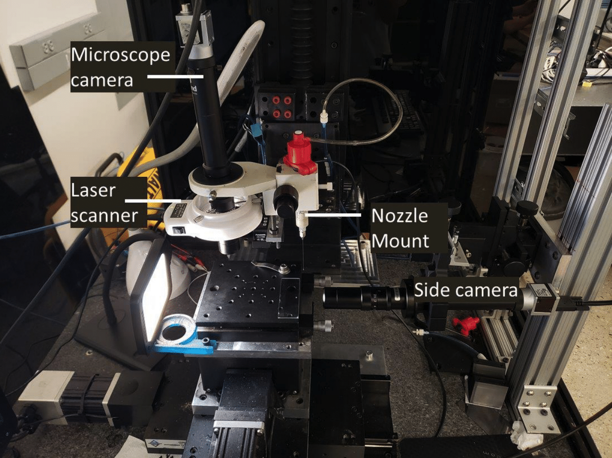

# Closing the Loop in 3D Printing 

## Welcome to CL3DP Documentation

This guide provides a comprehensive walkthrough for installing, testing, and conducting ink printing experiments using Aerotech stages. The document outlines the essential software installations necessary for the process and offers a brief overview of each software component.

Note: This document is targeted towards setup in Barton Research Group at University of Michigan. If you intend to develop for company in collaboration, there are some changes in hardware which are as follow:

<ol>
<li>

Cameras used at UofM is manufactured by <b>Basler</b> which uses <b>PylonSDK</b>. Python library for that is called <b>PyPylon</b> which can be installed from upstream package manager like Pip. While in case of company in collaboration, the camera is manufactured by <b>Teledyne Flir</b> which uses <b>Spinnaker SDK</b>. Spinnaker has customized Python SDK which can only be downloaded from their website. Make sure to check version of base SDK and Python one since they need to be same for compatibility. 
</li>

<li>

Stages used at UofM and company in collaboration are from the same manufacturer and hence the codebase is similar. There is a small difference in extrusion system. For UofM system, the pressure is used to control extrusion so apply pressure to print and cut suppy to stop. While in case of company, they have an extra 4th stage which acts as a smart pump. For them the pressure is kept on for the entire experiment and this 4th stage moves up-down to allow flow of ink. 
</li>
</ol>