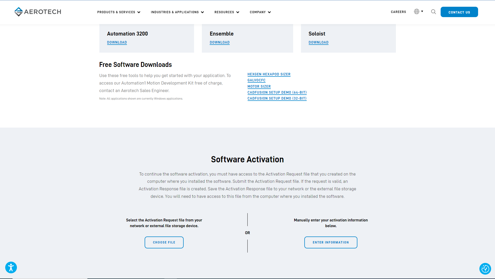

# A3200 Overview

The Aerotech A3200 is a powerful and versatile software platform designed for high-precision motion control. It is widely used in various industries including manufacturing, automation, and research. The A3200 integrates motion, vision, PLC, robotics, and I/O control into a unified architecture, providing a comprehensive solution for complex automation tasks. Currently, it is supported only for Windows OS.

1. Download [A3200 software](https://www.aerotech.com/resources-software-downloads-activation/) from Aerotech website

2. Open A3200 configuration manager with system specific configuration file

3. Open A3200 CNC Operator and test stage movements

