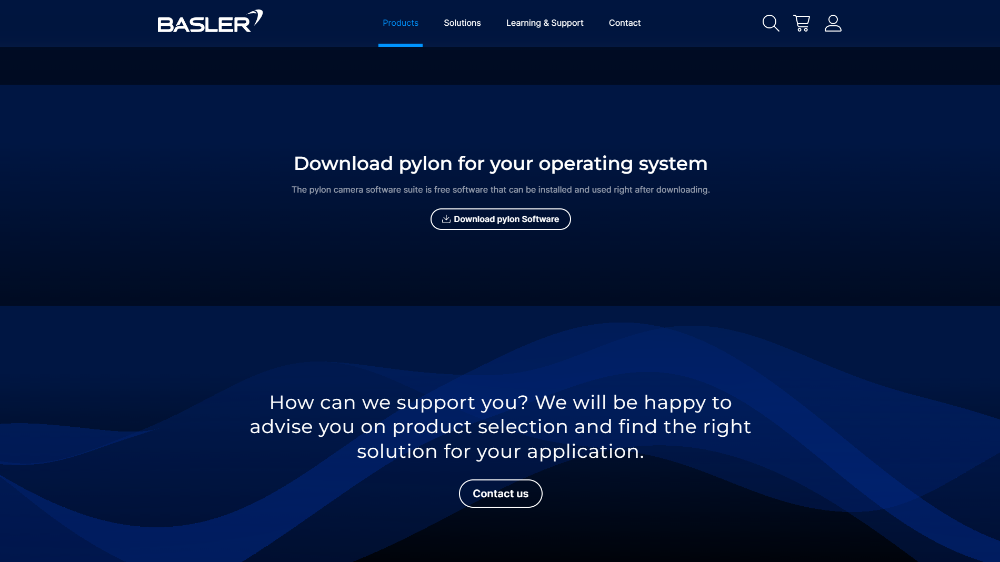
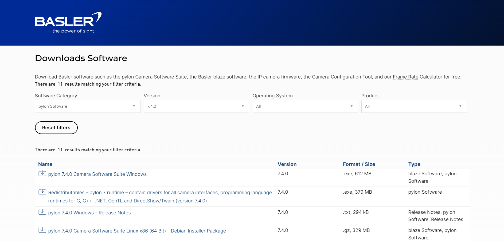
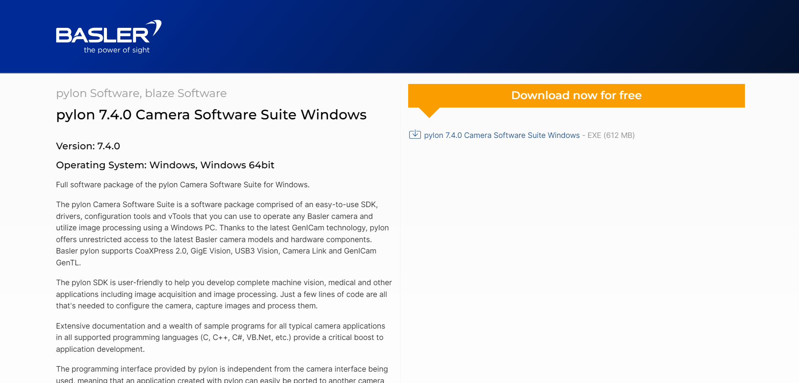
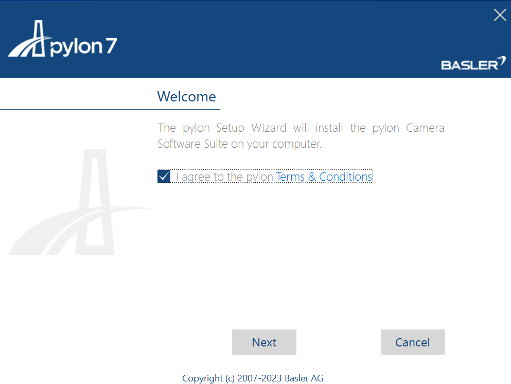
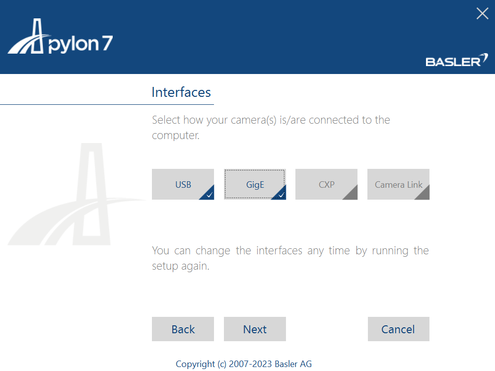
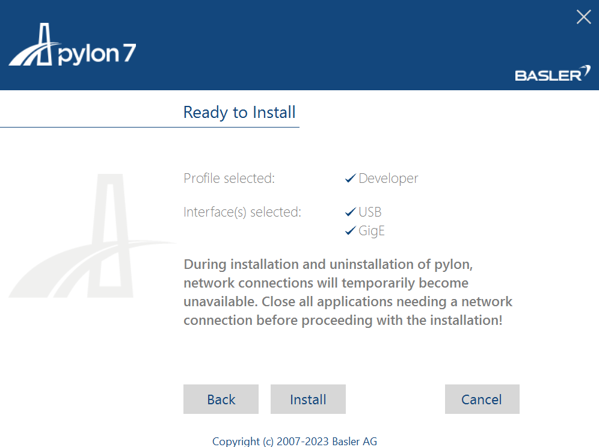
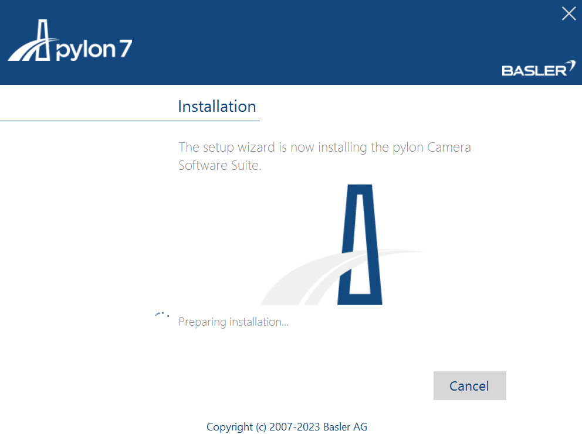
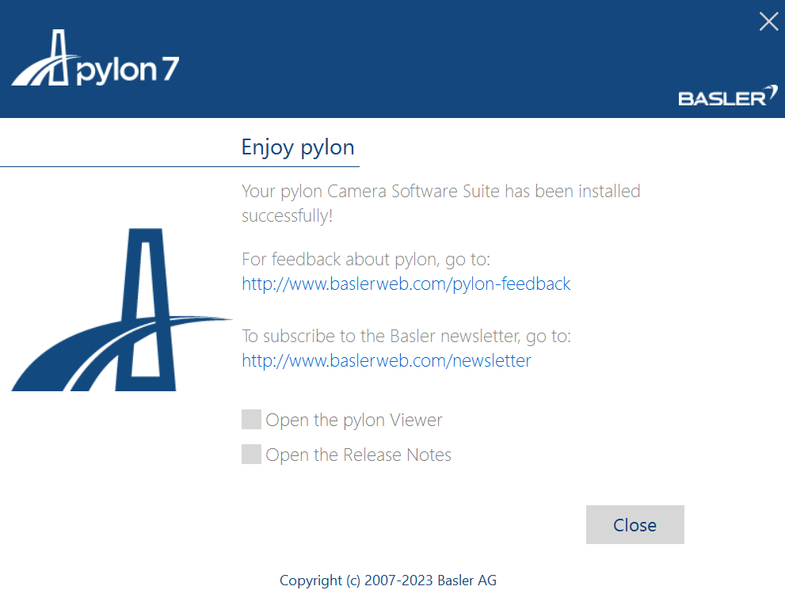
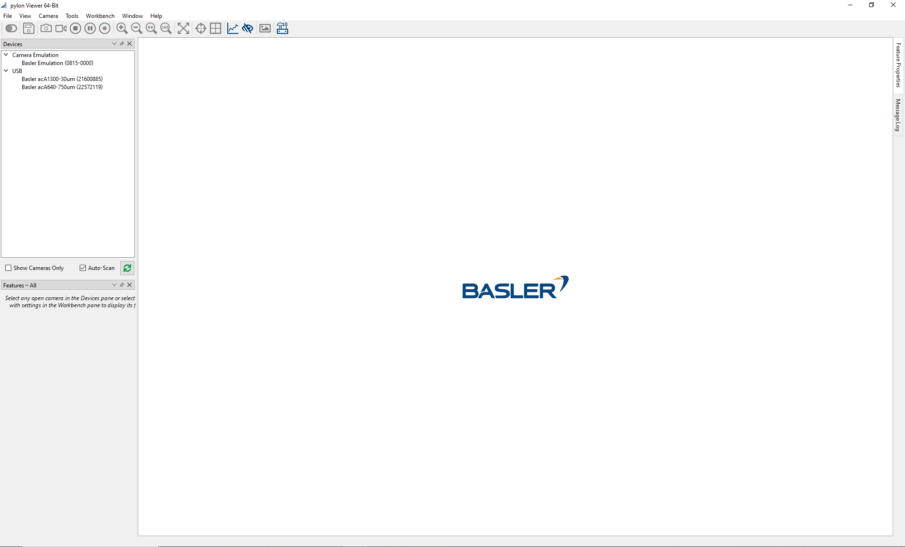

# Camera 

Our system is optimized for seamless operation with Basler's Pylon cameras, utilizing the Pylon SDK and the PyPylon API for effortless control and integration. To get started, the first essential step is to install the Pylon Software from Basler. This ensures that you can leverage the full capabilities of Basler cameras within our system, providing you with high-quality imaging and efficient control.

1. Download [Pylon SDK](https://www.baslerweb.com/en-us/software/pylon/sdk/) from Basler's Website
    - Navigate to the Basler Pylon SDK download page.
    - Ensure you are on the official Basler website to avoid any unauthorized or malicious software.

2. Select Camera Suite for Windows
    - On the download page, locate the section for Windows OS.
    - Choose the appropriate camera suite that matches your operating system version (e.g., Windows 10, 64-bit).

3. Fill in Details to Download SDK
    - You may be prompted to fill out a form with your personal and professional details.
    - Provide accurate information as required by Basler to proceed with the download.

4. Download .exe File
    - After submitting the form, the download link for the Pylon SDK installer (.exe file) will be provided.
    - Click on the link to download the installer to your local machine.

5. Agree to Terms and Conditions
    - Run the downloaded .exe file.
    - A prompt will appear asking you to read and agree to the terms and conditions.
    - Carefully review the terms and conditions, then click "Agree" to proceed.

6. Select Developer Profile
    - The installer will ask you to choose a profile.
    - Select the "Developer" profile to ensure you have all necessary tools and libraries for development purposes.

7. Select All Applicable Interfaces
    - You will be prompted to select interfaces that are applicable to your setup.
    - Choose all the interfaces relevant to your cameras and applications (e.g., USB, GigE).

8. Keep the Default Destination Folder
    - The installer will suggest a default destination folder for the Pylon SDK installation.
    - It is recommended to keep the default destination unless you have specific requirements.

9. Verify and Install Pylon SDK
    - Review your selections and settings before proceeding.
    - Click "Install" to begin the installation process.

10. Wait for Installation to Complete
    - The installation process will take a few minutes.
    - Wait patiently until all components are installed.

11. Close Installer
    - Once the installation is complete, a prompt will indicate that the process is finished.
    - Click "Close" to exit the installer.

12. Open Pylon Viewer to Test Camera
    - After installation, locate the Pylon Viewer application from your start menu or desktop shortcut.
    - Launch Pylon Viewer to ensure that your camera is correctly recognized and functioning.
    - Test the camera by capturing images or video to verify the setup.
