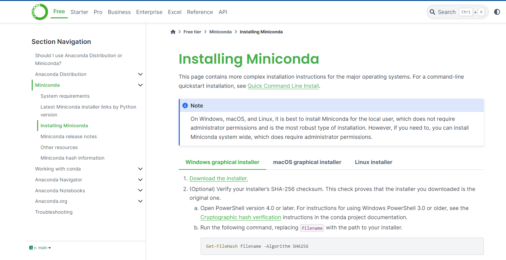
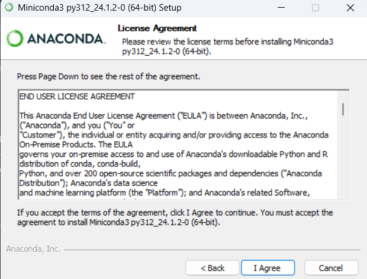
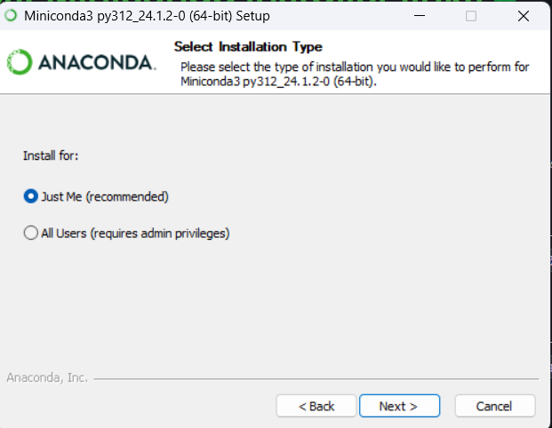
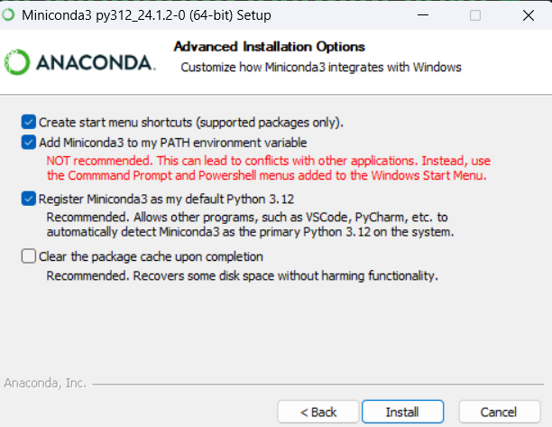
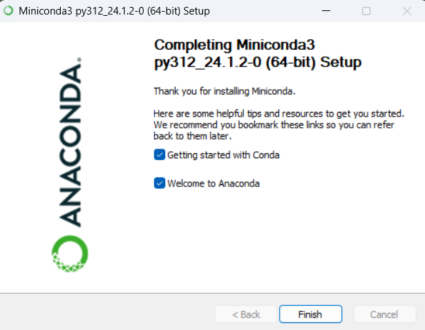

# Anaconda
 
Step-by-Step Guide to Installing Miniconda

1. Download Miniconda from Their Website
    - Navigate to the [Miniconda download page](https://docs.anaconda.com/miniconda/miniconda-install/).
    - Ensure you select the appropriate installer for your operating system (Windows in this case).

Note: Unless specified below, keep the default settings in the installer.

2. Agree to User License
    - Run the downloaded Miniconda installer.
    - A prompt will appear asking you to read and agree to the user license agreement.
    - Carefully review the agreement, then click "I Agree" to proceed.

3. Select All Users if Admin Privileges are Available
    - The installer will prompt you to choose between installing Miniconda for "Just Me" or "All Users".
    - Select "All Users" if you have administrative privileges on your machine to allow all users to access Miniconda.

4. Add Anaconda3 to PATH Environment
    - During the installation process, you will see an option to add Anaconda3 to your PATH environment variable.
    - Check the box to add Anaconda3 to the PATH. This makes it easier to use conda from the command line.

5. Finish Setup
    - Continue through the installation process, keeping the default settings unless you have specific preferences.
    - Once the installation is complete, a prompt will indicate that the process is finished.
