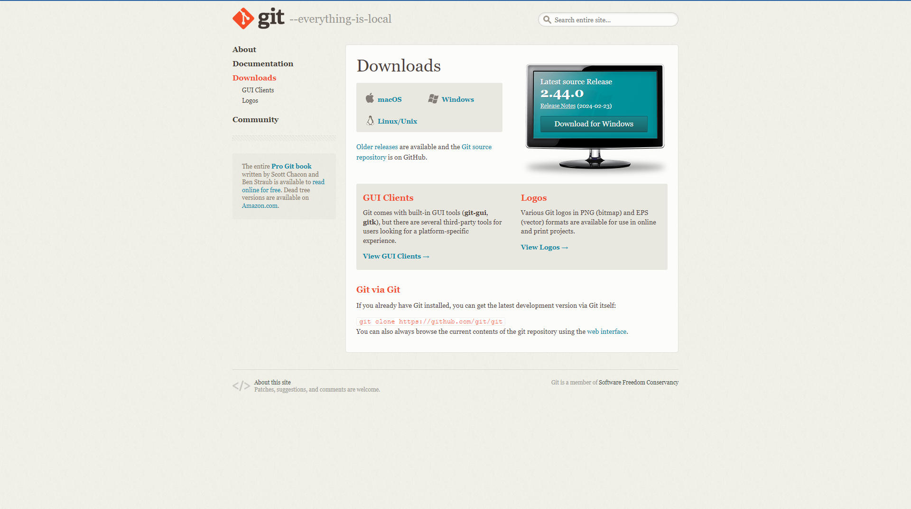
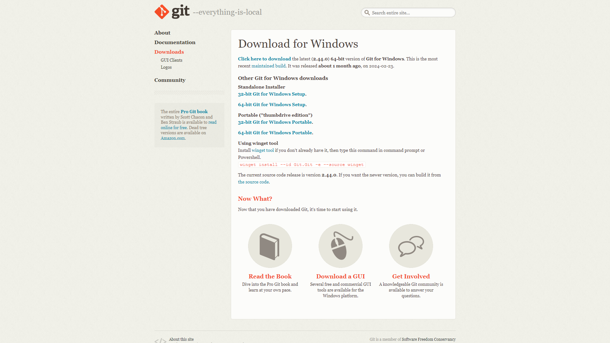
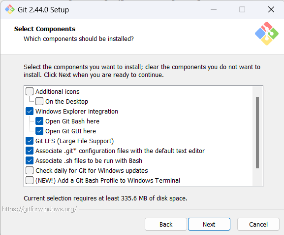
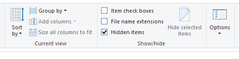
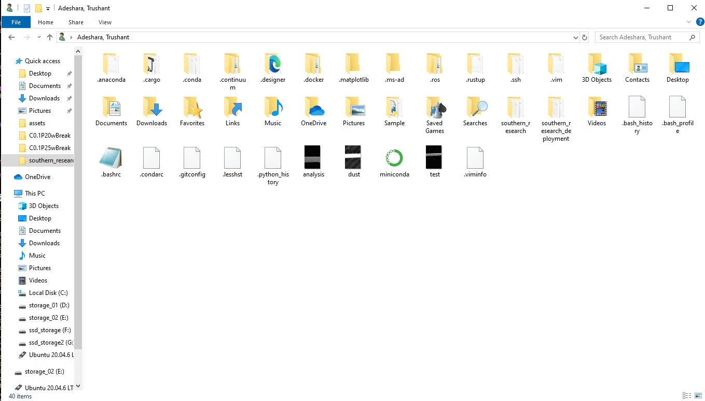

# Git Bash

1. Download Git Bash from Git Website
    - Navigate to the Git website.
    - Ensure you are on the official Git website to avoid any unauthorized or malicious software.


2. Select 64-bit Git for Windows Setup in Standalone Installer
    - On the download page, select the 64-bit Git for Windows setup.
    - Choose the standalone installer for ease of installation.


    Note: Unless specified, keep the default settings in the installer.

3. Open Git Bash Setup Tool
    - Open the directory where Git Bash is download.
    - Now execute the Git Bash Setup Tool and follow next steps.


4. Keep Default Component Selection
    - The setup tool will present a list of components to install.
    - Keep the default component selection to ensure all necessary components are installed.


5. Change Default Branch Name to Main Instead of Master
    - During the setup process, you will be prompted to configure the default branch name for new repositories.
    - Change the default branch name from "master" to "main" to align with modern conventions.


6. Complete Installation and Press Finish
    - Continue through the installation process, keeping the default settings unless you have specific preferences.
    - Once the installation is complete, a prompt will indicate that the process is finished.


7. Configure Git Bash to Work with Anaconda
    - If Anaconda is installed for the current user, navigate to the following location:
    
        ```{User} -> AppData -> Local -> miniconda3 -> etc -> profile.d```
    
    - If Anaconda is installed for all users or in the root directory, navigate to:
        
        ```{User} -> miniconda3 -> etc -> profile.d```

    

    

    - Open Git Bash from directory containing profile.d and execute following command:

        ```sh
        echo ". ${PWD}/conda.sh" >> ~/.bashrc
        ```

    - If the path contains spaces even in user name then use following command:

        ```sh
        echo ". '${PWD}'/conda.sh" >> ~/.bashrc
        ```

    - Open a new Git Bash terminal and write conda in it to test if its working:

        ```sh
        conda 
        ```

