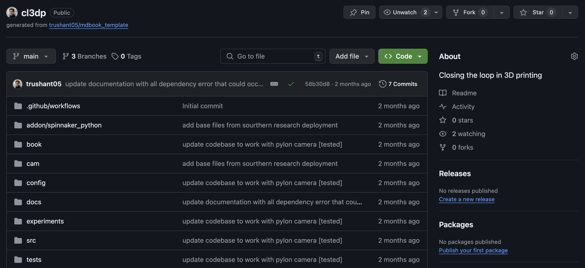
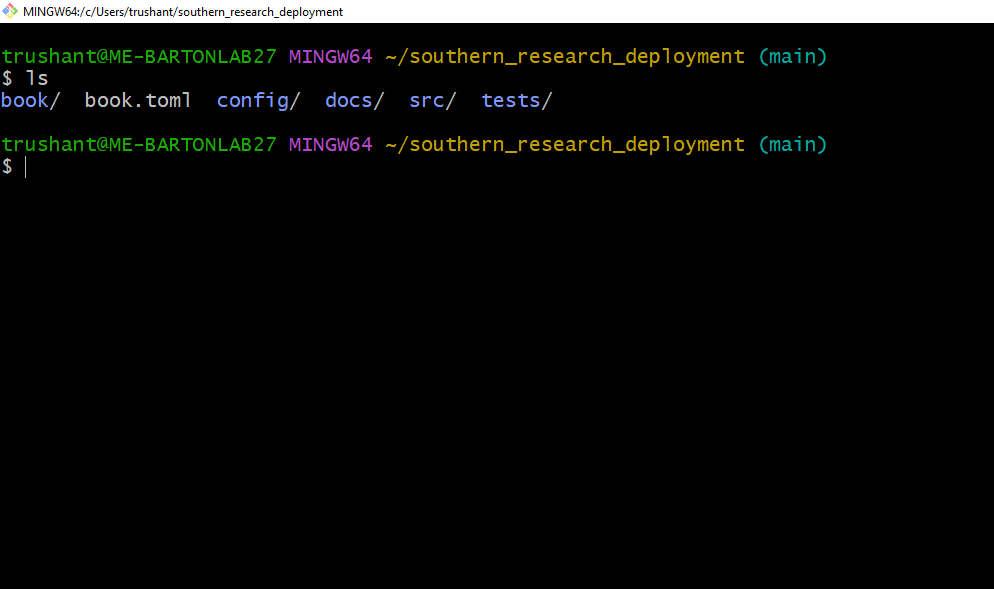
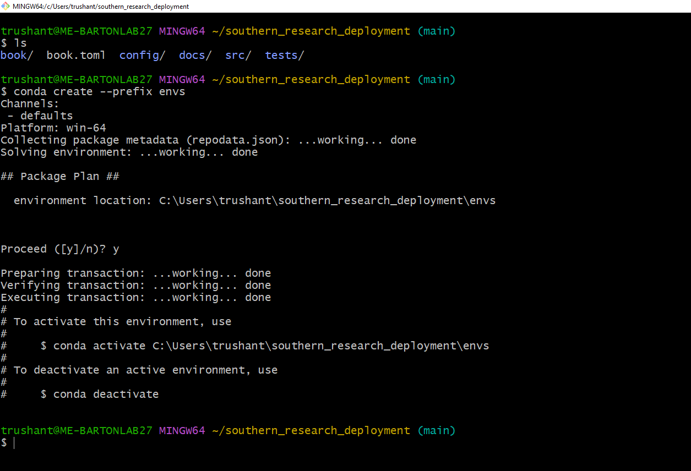

# Source Code

1. Download [cl3dp Repo](https://github.com/trushant05/cl3dp) from GitHub Either Via Xxtracting zip to Desired Location OR Cloning the Repo

    

2. Open Root Directory of cl3dp in Git Bash

    

3. Create a New Conda Environment
    - Use the following command to create a new conda environment with Python 3.8:

    ```sh
    conda create --prefix envs python=3.8 
    ```

    

4. Activate Conda Environment and Install Dependencies
    - Activate te newly created conda environment with the following command:

        ```sh
        conda activate ./envs 
        ```

    - Install the required dependencies listed in the *requirement.txt* file:

        ```sh
        pip install -r requirements.txt 
        ```

5. Possible Errors:
    - **Environment Activation Error** : If you encounter an error activating the environment, ensure 
        you are in correct directory and the environment path is correct.
    - **Dependency Installation Error** : If there are error installing dependencies, check for typos in 
        the file name and ensure all required packages are listed in the *requirements.txt* file.
    - **Compantibility Issues**: If there are compatibility issues with Python 3.8, consider using a different
        Python version specified in the project's documentation.

```sh
# sympy not found
pip install sympy

# yaml not found
pip install pyyaml

# argparse not found
pip install argparse

# numpy not found
pip install numpy

# cv2 not found
pip install opencv-python

# pypylon not found
pip install pypylon

# scipy not found 
pip install scipy
```