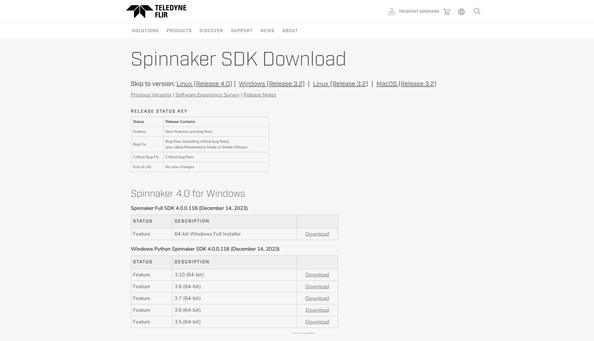
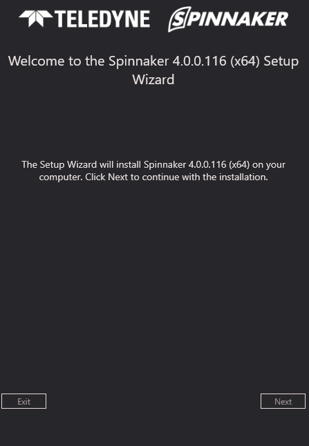
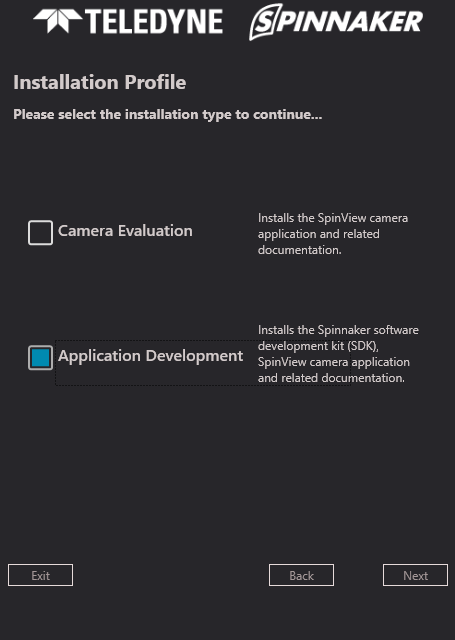
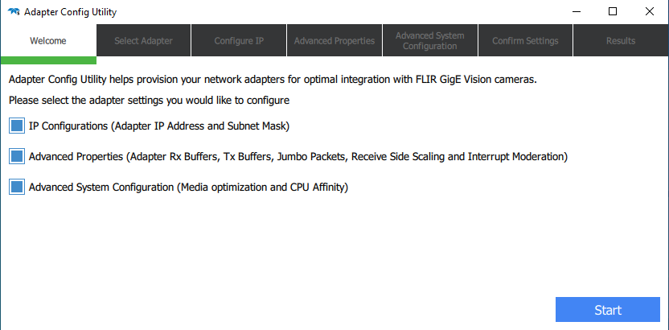

# Blackfly

1. Download [Spinnaker SDK](https://www.flir.com/discover/iis/machine-vision/spinnaker-sdk/) and Python Spinnaker of the same version from Teledyne Flir website:



### Note: Spinnaker's Python API for python3.8 is already in the repo. If you need another version, refer to this [site](https://www.flir.com/discover/iis/machine-vision/spinnaker-sdk/).

2. Install Spinnaker SDK with the wizard:



3. Select developer installation profile:



4. Make sure following components are selected:


5. Make sure GiGe driver is installed:


6. Spinnaker adaptor configuration:



7. Open Spin Viewer to test working:


In order to configure Spinnaker's Python API, activate your conda environment if not already:

```
conda activate ./envs
```

Now install PySpin into your conda environment:

```
pip install addon/spinnaker_python/spinnaker_python-4.0.0.116-cp38-cp38-win_amd64.whl
```


