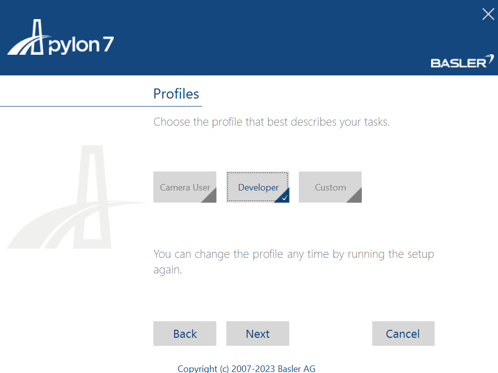

# PylonSDK

### 1. Download [Pylon SDK](https://www.baslerweb.com/en-us/software/pylon/sdk/) from Basler's website:

### 2. Select camera suite for windows:

### 3. Fill in details to download SDK:

### 4. Download .exe file:

### 5. Agree to terms and conditions:

### 6. Select developer profile:

### 7. Select all the interfaces applicable:

### 8. Keep the default destination folder:

### 9. Verify and install Pylon SDK:

### 10. Wait for installation to complete:

### 11. Close installer:

### 12. Once installed open Pylon Viewer to test camera:

