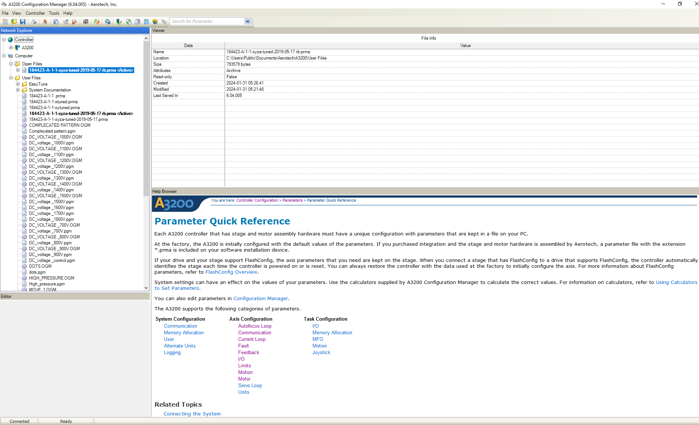
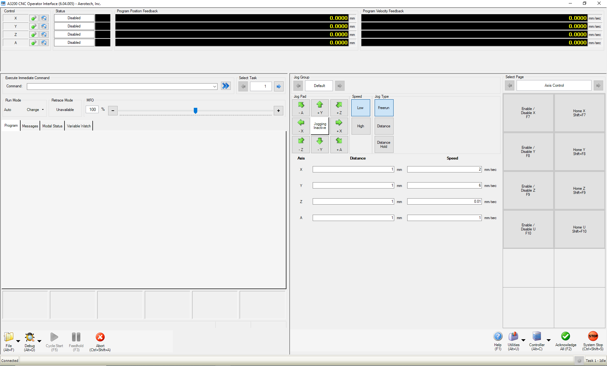

# A3200

### 1. Download [A3200](https://www.aerotech.com/resources-software-downloads-activation/) software from Aerotech website:

### 2. Open A3200 Configuration Manager with system specific configuration file:

### 3. Open A3200 CNC Operator and test stage movements:

