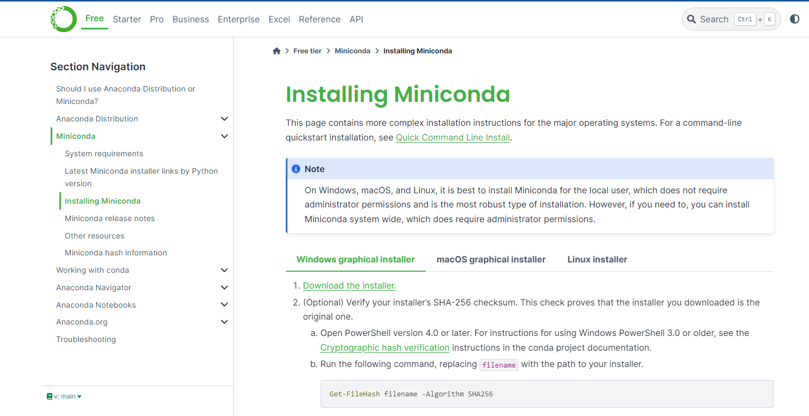
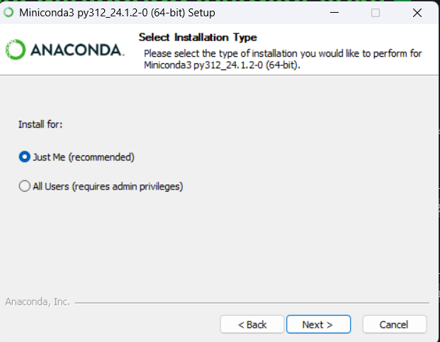
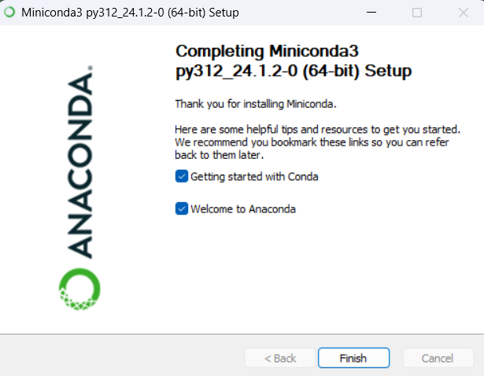

# Miniconda

### 1. Download [Miniconda](https://docs.anaconda.com/free/miniconda/miniconda-install/) from their website:

## Note: Unless specified below, keep default setting in installer.

### 2. Agree User License:

### 3. Select All Users if admin privileges available:

### 4. Add Anaconda3 to PATH environment:

### 5. Finsh Setup:

