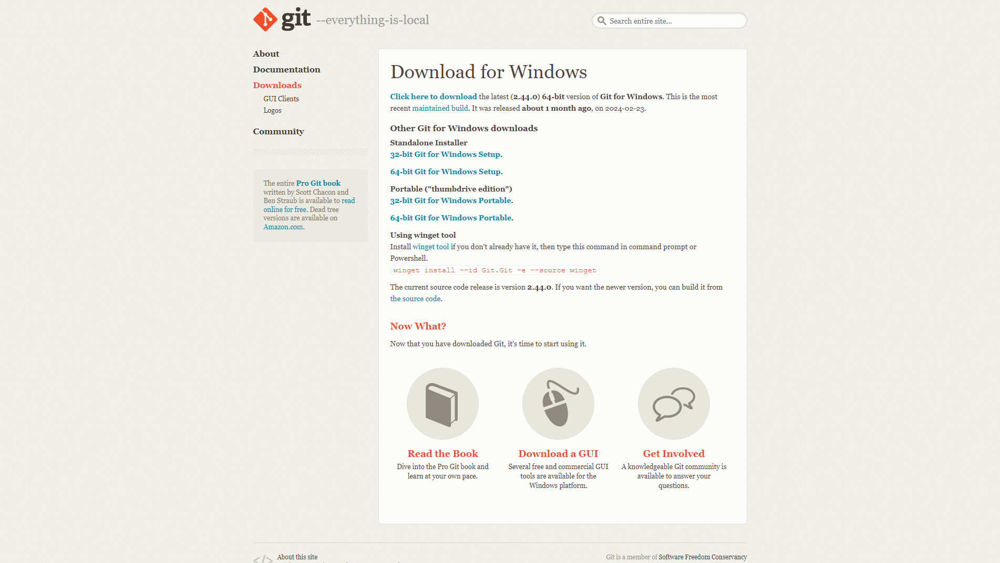
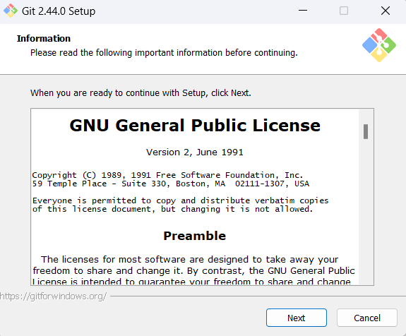
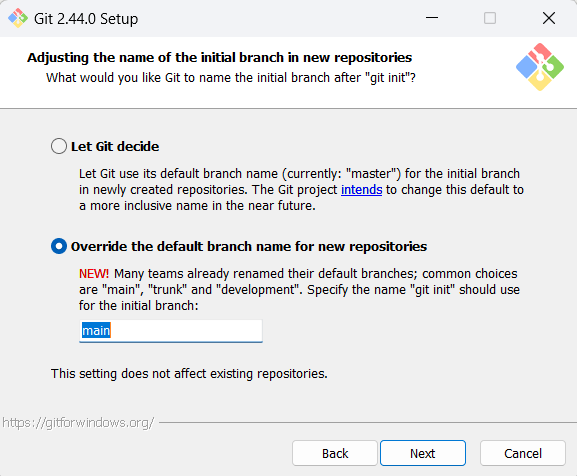
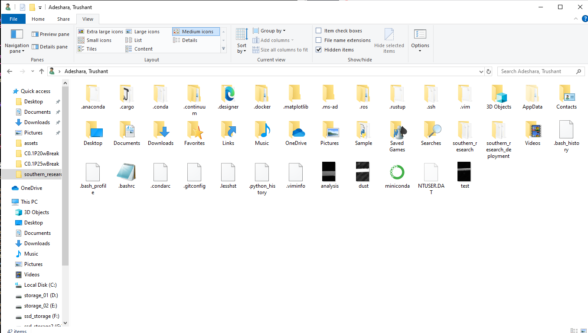

# Git Bash

### 1. Download [Git Bash](https://git-scm.com/download/win) from Git website:


### 2. Select **64-bit** Git for Windows Setup in **Standalone Installer**:


## Note: Unless specified below keep default settings in installer.

### 3. Open Git Bash setup tool:


### 4. Keep default component selection:


### 5. Change default branch to main instead of master:


### 6. Complete installation and press Finish:


### 7. Configure Git Bash to work with Anaconda:
 If Anaconda is installed for current user then navigate to following location, else look for it in the root directory. Got to your user directory as follow:

Goto **{User} -> AppData -> Local -> miniconda3 -> etc -> profile.d** 

Alternative location **{User} -> miniconda3 -> etc -> profile.d**





- Open Git Bash from directory containing profile.d and execute following command:
```
echo ". ${PWD}/conda.sh" >> ~/.bashrc
```

- If the path contains spaces even in user name then use following command:
```
echo ". '${PWD}'/conda.sh" >> ~/.bashrc
```

- Open a new Git Bash terminal and write conda in it to test if its working.
