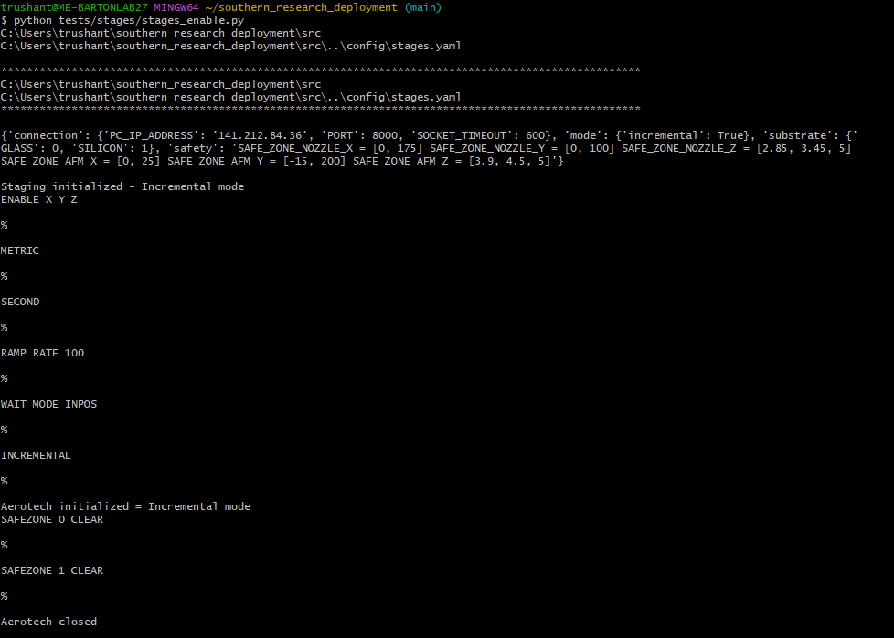
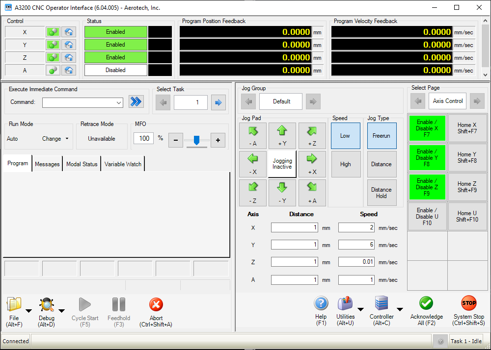

# Testing Stage Connection

<p align="justify">In order to test if the connection with stages is established, we can run <b>tests -> stages -> stages_enable.py </b> file which will enable all three (X, Y and Z stage) by using following command. </p> 

```
python tests/stages/stages_enable.py
```


The output states following:
- All three stages (X, Y and Z) are enabled in incremental mode.
- They are using SI units (Metric, Second).
- RAMP Rate is set to 100.
- All safezones are cleared.
- Lastly, Aerotech connection is closed after sending the commands.


Verification to this could be done using A3200 CNC Operator.



